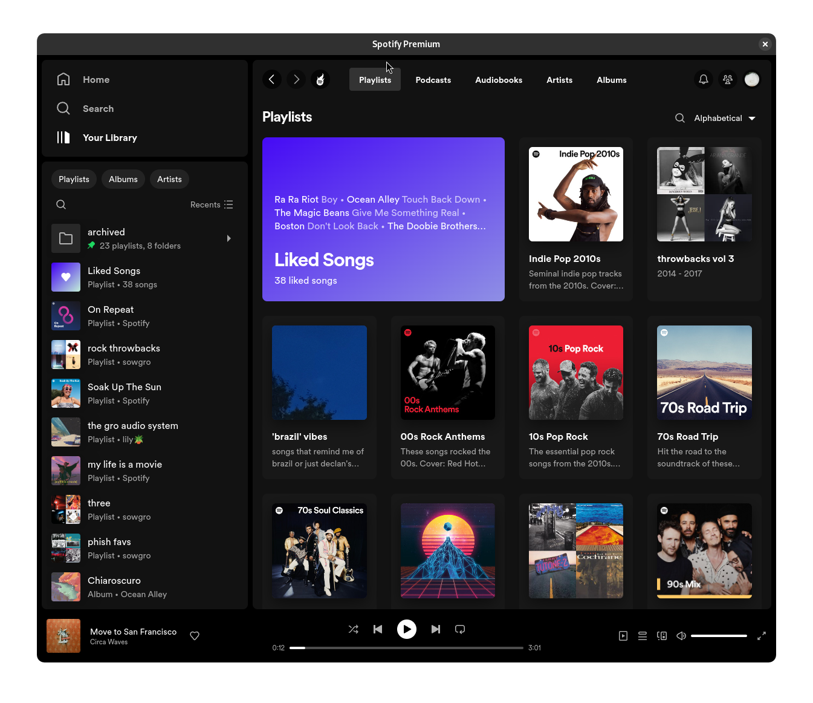

# betterLibrary
A Spicetify custom app which brings back the old library



## Installation
1. Download the source code and unzip it if necessary.
2. Copy betterLibrary from the CustomApps folder into your Spicetify CustomApps folder.
3. Run the following commands to enable the custom app:

    ```
    spicetify config custom_apps betterLibrary
    ```
    ```
    spicetify apply
    ```
